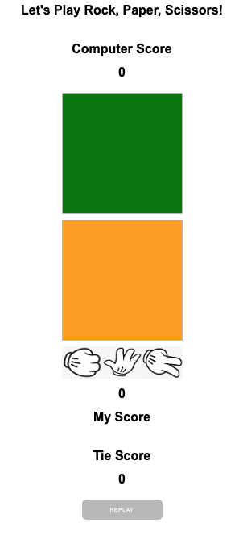

# ROCK, PAPER, SCISSORS GAME

Welcome to [Rock, Paper, Scissors Game](https://westie22.github.io/rock-paper-scissors/) website!
This is a website of playing "Rock, Paper, or Scissors" against Computer. As you play the game vs Computer, you or the computer get scores and the game allows you to reset the game that start from score 0.

## Requirements
* HTML
* CSS
* JavaScript

## Introduction
This game has only two outcomes: a win for player which means a loss for the computer and a tie. Me the player choose to play 'rock' it will beat the computer which it can only choose one randomly.

## How to play
Me, the player choose one images from 'rock', 'paper', or 'scissors', meanwhile opponent, the computer will have a random decision, and it shows immediately who won with scores added.

* Initial site veiw

