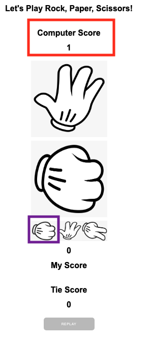
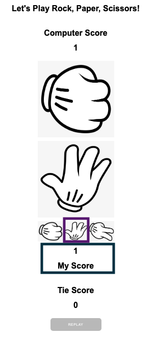
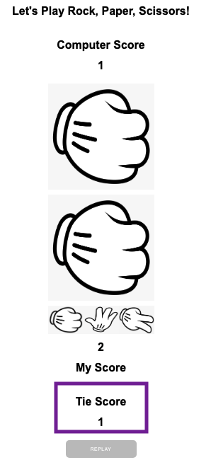

# ROCK PAPER SCISSORS GAME

Welcome to [Rock, Paper, Scissors Game](https://westie22.github.io/rock-paper-scissors/) website!
This is a website of playing "Rock, Paper, or Scissors" against Computer. As you play the game vs Computer, you or the computer get scores and the game allows you to reset the game that start from score 0.

## Requirements
* HTML
* CSS
* JavaScript

## Introduction
This game has only two outcomes: a win for player which means a loss for the computer and a tie. Me the player choose to play 'rock' it will beat the computer which it can only choose one randomly.

## How to play
Me, the player choose one images from 'rock', 'paper', or 'scissors', meanwhile opponent, the computer will have a random decision, and it shows immediately who won with scores added.

1.  Initial site contains Computer Score, My Score, Tie Score and Reset. Default images for both players are set on 'rock'.

2. "I" decide a 'rock' first, and the computer chooses a 'paper'. That means the computer won and its score is added up 1.

3. "I" dicide a 'paper' now, and the computer chooses a 'rock'. That means "I" won this match, and My Score is now 1.

4. "I" decide a 'scissors', and the computer chooses a 'paper', which "I" won again and My Score is now 2.

5. When the match is tie! : "I" decide another 'rock' and the computer also chooses a 'rock'. As the match is draw, score 1 is now added to Tie Score.

6. Game reset from score 0 for all players : very buttom, there is a 'Replay' button. Once it's clicked, all the scores reset to 0 for both players and the site shows the initial view. 

7. After 5 scores obtains the site tells you who is the winner and a new game can be started as both scores will set 0 for both.

8. When the Tie Score gets 3, the game will be reset to 0 for both players.

9. Reply the game nonetherless who is winning, if you don't like losing, click the "REPLAY" button!

## Validator Testing
 - HTML
   - No errors were returned when passing through the official [W3C Validator](https://validator.w3.org/nu/?doc=https%3A%2F%2Fwestie22.github.io%2Frock-paper-scissors%2Findex.html) for Home page.
 - CSS
   - No errors were found when passing through the official [(Jigsaw) Validator](https://jigsaw.w3.org/css-validator/validator?uri=https%3A%2F%2Fwestie22.github.io%2Frock-paper-scissors%2F&profile=css3svg&usermedium=all&warning=1&vextwarning=&lang=en).
 - JavaScript
   - Codes are syntactically valid through the official [ExtendsClass Validator](https://extendsclass.com/javascript-fiddle.html).
   - Manage to check with raw codes, a screenshot is the only way to approve.
  

- Accessibility
I confirmed that the colors and fonts chosen are easy to ready and accessible by running it via Lighthouse in devtools.

## Deployment
- This site was deployed to GitHub pages. The steps to deploy are as below:
  - In the GitHub repository, naviagte to the Setting tab
  - From the soure section, left-side, select Page
  - From the Page, the source section drop-down menu, select the Master Branch
  - Underneath the Master Branch, selct 'main' and '/root' from the Branch
  - Once the master branch has been selected, the page will be automatically refreshed with a detailed ribbon display to indicate the successful deployment.
The live link can be found here - https://westie22.github.io/rock-paper-scissors/

### Features Left to Fix/Implement
- After 5 rounds and the site tells who the winner is, however both scores are set 0 but not automatically able to replay.(currently REPLAY button must be click to continue the game

### Acknowledgement
- This site-css is inspried and taken by Code Institute project "Love Maths" for the basic structures.
- This site is also inspired by this [YouTube](https://www.youtube.com/watch?v=EfAl9bwzVZk&t=5063s) & this [YouTube](https://www.youtube.com/watch?v=4eeY0JFEMs8&t=252s), and [YouTube](https://www.youtube.com/watch?v=fIBOydve2f8) channels for the basic & main stuctures. 
- This site is learned by are learned from [W3schools](https://www.w3schools.com/) site.
- This project is also learned by [Stackoverflow.com](https://stackoverflow.com/)to resolve problems.
- This project is learned from [DOM Events Reference](https://developer.mozilla.org/en-US/docs/Web/Events).

### Media
- The rock, paper, scissors images are from this open source site [Seekpng](https://www.seekpng.com/).

