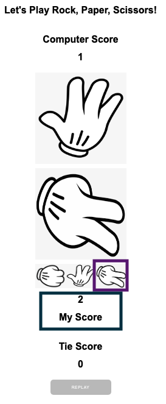

# ROCK PAPER SCISSORS GAME

Welcome to [Rock, Paper, Scissors Game](https://westie22.github.io/rock-paper-scissors/) website!
This is a website of playing "Rock, Paper, or Scissors" against Computer. As you play the game vs Computer, you or the computer get scores and the game allows you to reset the game that start from score 0.

## Requirements
* HTML
* CSS
* JavaScript

## Introduction
This game has only two outcomes: a win for player which means a loss for the computer and a tie. Me the player choose to play 'rock' it will beat the computer which it can only choose one randomly.

## How to play
Me, the player choose one images from 'rock', 'paper', or 'scissors', meanwhile opponent, the computer will have a random decision, and it shows immediately who won with scores added.

1.  Initial site contains Computer Score, My Score, Tie Score and Reset. When these two colurs - Green & Orange means, the game has not been played yet.

2. "I" decide a 'rock' first, and the computer chooses a 'paper'. That means the computer won and its score is added up 1.

3. "I" dicide a 'paper' now, and the computer chooses a 'rock'. That means "I" won this match, and My Score is now 1.

4. "I" decide a 'scissors', and the computer chooses a 'paper', which "I" won again and My Score is now 2.

5. When the match is tie! : "I" decide another 'rock' and the computer also chooses a 'rock'. As the match is draw, score 1 is now added to Tie Score.

6. Game reset from score 0 for all players : very buttom, there is a 'Replay' button. Once it's clicked, all the scores reset to 0 for both players and the site shows the initial view. 

7. Reply the game!
